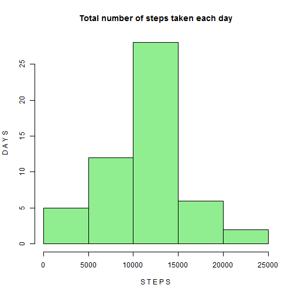

## Reproducible Research Assignment 1
--------------------------------------
Instructions:
When writing code chunks in the R markdown document, 
always use echo = TRUE so that someone else will be able to read the code.


## Loading and preprocessing the data
---------------------------------------
Show any code that is needed to
Load the data (i.e. read.csv())
Process/transform the data (if necessary) into a format suitable for your analysis
Code:
------

```r
act_data <- read.csv("activity.csv", header = TRUE)
activity_data <- act_data[which(act_data$steps != "NA"), ]
```

## What is mean total number of steps taken per day?
----------------------------------------------------
1. Make a histogram of the total number of steps taken each day

Code:
------

```r
steps_total <- aggregate(steps ~ date, data = activity_data, FUN = sum, na.rm = TRUE)
hist(steps_total$steps, names.arg = steps_total$date, main = "Total number of steps taken each day", 
    ylab = "D A Y S", xlab = "S T E P S", col = "light green")
```

```
## Warning: "names.arg" is not a graphical parameter
## Warning: "names.arg" is not a graphical parameter
## Warning: "names.arg" is not a graphical parameter
```

 


2.Calculate and report the mean and median total number of steps taken per day

Code:
------

```r
mean(steps_total$steps)
```

```
## [1] 10766
```

```r
median(steps_total$steps)
```

```
## [1] 10765
```

Results:
---------
Mean =1.0766 &times; 10<sup>4</sup>
Median = 10765 

## What is the average daily activity pattern?
----------------------------------------------
1.Make a time series plot (i.e. type = "l") of the 5-minute interval (x-axis) and the average number of steps taken, averaged across all days (y-axis)

Code:
------

```r
S_Interval <- aggregate(steps ~ interval, data = activity_data, mean, na.rm = TRUE)
plot(steps ~ interval, data = S_Interval, type = "l", main = "average number of steps taken", 
    ylab = "I N T E R V A L ", xlab = "S T E P S", col = "blue")
```

 


2.Which 5-minute interval, on average across all the days in the dataset, contains the maximum number of steps?
Code:
------

```r
S_Interval[which.max(S_Interval$steps), ]$interval
```

```
## [1] 835
```

## Imputing missing values
---------------------------

1.Calculate and report the total number of missing values in the dataset (i.e. the total number of rows with NAs)

Code:
------

```r
sum(is.na(act_data$steps))
```

```
## [1] 2304
```


2.Devise a strategy for filling in all of the missing values in the dataset. The strategy does not need to be sophisticated. For example, you could use the mean/median for that day, or the mean for that 5-minute interval, etc.

Code:
------


```r
new_data <- act_data
new_data <- merge(new_data, S_Interval, by = "interval", suffixes = c("", ".y"))
na_d <- is.na(new_data$steps)
new_data$steps[na_d] <- new_data$steps.y[na_d]
new_data <- new_data[, c(1:3)]
```

3.Create a new dataset that is equal to the original dataset but with the missing data filled in.

new_data is new dataset

4.Make a histogram of the total number of steps taken each day and Calculate and report the mean and median total number of steps taken per day. Do these values differ from the estimates from the first part of the assignment? What is the impact of imputing missing data on the estimates of the total daily number of steps?
Code:
------


```r
totalSteps <- aggregate(steps ~ date, data = new_data, sum)
hist(totalSteps$steps, main = "Total number of steps taken each day", ylab = "D A Y S", 
    xlab = "S T E P S", col = "cyan")
```

 

```r
mean(totalSteps$steps)
```

```
## [1] 10766
```

```r
median(totalSteps$steps)
```

```
## [1] 10766
```


Values are same after filling in the missing values onlu Median changes


## Are there differences in activity patterns between weekdays and weekends?
---------------------------------------------------------------------------

1.Create a new factor variable in the dataset with two levels - "weekday" and "weekend" indicating whether a given date is a weekday or weekend day

Code:
-------

```r
newdata <- new_data
newdata$day = ifelse(as.POSIXlt(as.Date(newdata$date))$wday%%6 == 0, "weekend", 
    "weekday")

newdata$day = factor(newdata$day, levels = c("weekday", "weekend"))
```

2.Make a panel plot containing a time series plot (i.e. type = "l") of the 5-minute interval (x-axis) and the average number of steps taken, averaged across all weekday days or weekend days (y-axis). The plot should look something like the following, which was creating using simulated data:

Code:
------

```r
library(lattice)
xyplot(steps ~ interval | day, data = newdata, layout = c(1, 2), type = "l")
```

 

